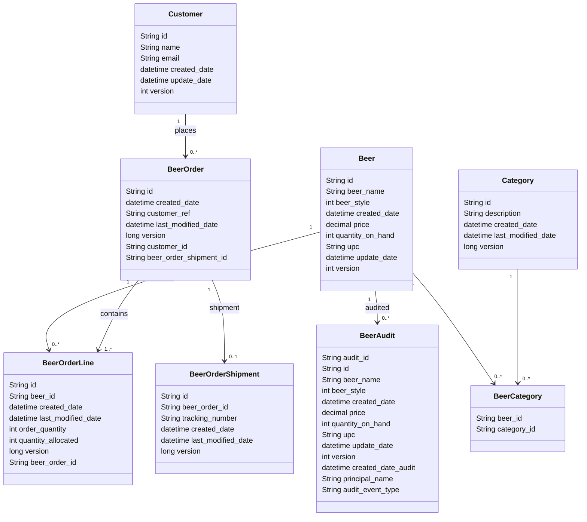
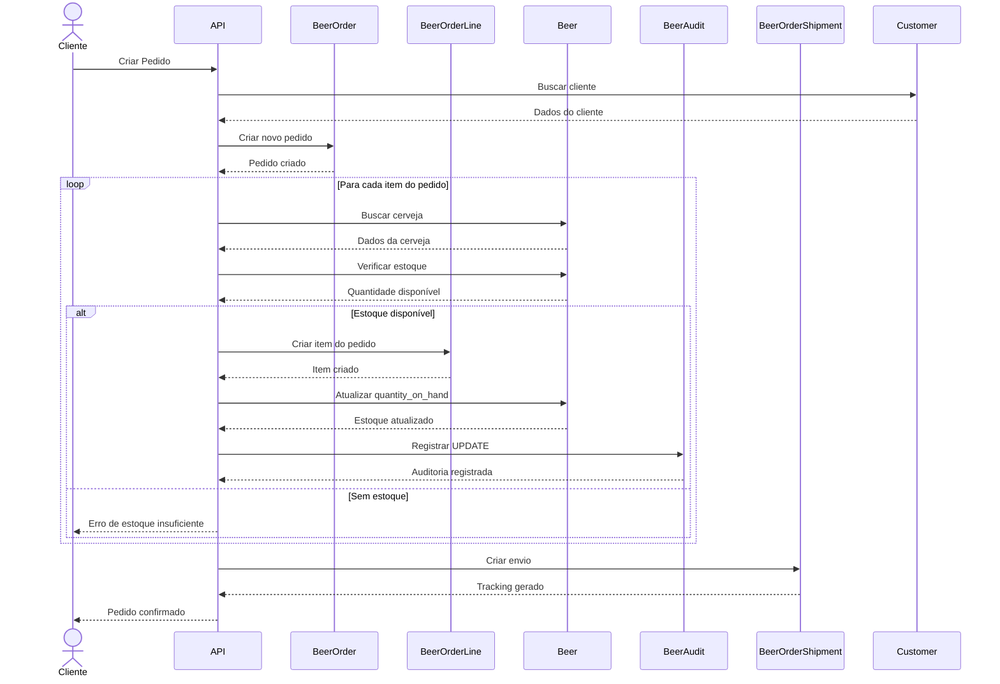

# Spring 7 Playground - Arquiteturas e Tecnologias

Este repositório reúne diversos projetos independentes com o objetivo de explorar, demonstrar e consolidar conhecimentos
no ecossistema **Spring 7 + Spring Boot 4**, utilizando **Java 25 (LTS)**.

Os projetos fazem parte do curso **"Spring Boot 4, Spring Framework 7: Beginner to Guru" (Udemy)** e evoluem
progressivamente conforme o avanço no conteúdo.

Atualmente, o progresso acompanha todo o roadmap do curso, com módulos sendo implementados gradualmente.

Cada módulo explora uma **tecnologia ou estilo arquitetural específico**, abrangendo aplicações tradicionais, reativas,
segurança, integração e API Gateway.

## Conteúdo do Curso

### Fundamentos

1. Introduction
2. Building a Spring Boot Web App
3. Performing Dependency Injection with Spring

### Web e APIs REST (Spring MVC)

4. Introduction to RESTful Web Services
5. Using Project Lombok with Spring Boot
6. Spring MVC Rest Services
7. Spring MockMVC Test with Mockito and JUnit
8. Exception Handling with Spring MVC
9. Spring Data JPA with Spring MVC
10. Data Validation with Spring
11. MySQL with Spring Boot
12. Flyway Migrations with Spring Boot
13. Using Testcontainers with Spring Boot
14. CSV File Upload
15. Query Parameters with Spring MVC
16. Paging and Sorting with Spring MVC
17. JPA Database Relationship Mapping
18. Database Transactions, Locking and Spring

### Integração e Clientes HTTP

19. Introduction to Spring Data REST
20. Spring RestTemplate
21. Testing Spring RestTemplate

### Segurança

22. Spring Security HTTP Basic Auth
23. Spring Authorization Server
24. Spring MVC OAuth2 Resource Server
25. Spring RestTemplate with OAuth2

### Programação Reativa (WebFlux)

26. Introduction to Reactive Programming with Spring
27. Spring Data R2DBC
28. Spring WebFlux Rest Services
29. Spring WebFlux WebTestClient
30. Exception Handling with Spring WebFlux
31. Spring Data MongoDB
32. Spring WebFlux.fn REST Services
33. Spring WebClient
34. Spring WebFlux Resource Server
35. Spring WebFlux.fn Resource Server
36. Using OAuth 2.0 with Spring WebClient

### Cloud e Gateway

37. Spring Cloud Gateway

### Build e Documentação

38. Spring Boot Maven Plugin
39. Spring Boot Gradle Plugin
40. OpenAPI with Spring Boot
41. OpenAPI Validation with RestAssured

### Tópicos Avançados

42. Introduction to Spring AI
43. Spring RestClient
44. Spring Boot Actuator
45. Request Logging
46. Caching Data with Spring Framework
47. Spring Application Events for Auditing
48. Using your Spring Boot Skills

### Containers e Orquestração

49. Docker with Spring Boot
50. Docker Compose with Spring Boot
51. Kubernetes with Spring Boot

### Microservices

52. Introduction to Spring Boot Microservices
53. Spring Boot Microservices with Apache Kafka

### Certificação e Boas Práticas

54. Spring Professional Certification Practice Test
55. New Spring Boot 3.4.0 Features
56. Spring Boot Engineering Best Practices

### Extras

57. Appendix A: Using GitHub
58. Extra - Introduction to Junie and JetBrains AI
59. Extra - Interviews
60. Extra - Kube by Example - Building Spring Boot Docker Images
61. Extra - Kube by Example - Spring Boot on Kubernetes
62. Extra - Kube by Example - Spring Boot Microservices on Kubernetes

## Projetos

| Projeto                                                   | Descrição                                                    | Tecnologias Principais                        |
|-----------------------------------------------------------|--------------------------------------------------------------|-----------------------------------------------|
| [spring-7-webapp](./spring-7-webapp)                      | Aplicação Web tradicional com MVC e renderização server-side | Spring MVC, Thymeleaf, JPA, H2                |
| [spring-7-di](./spring-7-di)                              | Demonstração de Injeção de Dependência (IoC)                 | Spring Core, Mockito, JUnit                   |
| [spring-7-rest-mvc](./spring-7-rest-mvc)                  | API REST completa com arquitetura em camadas                 | Spring MVC, JPA, Flyway, Security, OpenAPI    |
| [sdjpa-spring-data-rest](./sdjpa-springdatarest)          | Exposição automática de repositórios como APIs REST          | Spring Data REST, JPA, H2                     |
| [spring-7-resttemplate](./spring-7-resttemplate)          | Consumo de APIs com cliente HTTP síncrono                    | RestTemplate, RestClient, OAuth2 Client       |
| [spring-7-auth-server](./spring-7-auth-server)            | Servidor de autenticação e autorização OAuth2                | Spring Authorization Server, Security, JDBC   |
| [spring-7-reactive-examples](./spring-7-reactive-example) | Exemplos práticos de programação reativa                     | WebFlux, Reactor, Lombok                      |
| [spring-7-reactive](./spring-7-reactive)                  | Aplicação reativa com persistência relacional                | WebFlux, R2DBC, H2                            |
| [spring-7-reactive-mongo](./spring-7-reactive-mongo)      | Aplicação reativa com persistência NoSQL                     | WebFlux, MongoDB Reactive                     |
| [spring-7-webclient](./spring-7-webclient)                | Consumo de APIs com cliente HTTP reativo                     | WebClient, OAuth2 Client                      |
| [spring-7-gateway](./spring-7-gateway)                    | API Gateway reativo para roteamento e segurança              | Spring Cloud Gateway, OAuth2 Resource Server  |
| [spring-7-gateway-gradle](./spring-7-gateway-gradle)      | API Gateway reativo utilizando build com Gradle              | Spring Cloud Gateway, WebFlux, Gradle, OAuth2 |
| [spring-7-ai-intro](./spring-7-ai-intro)                  | Spring AI                                                    | Spring AI, Spring Web MVC                     |
| [spring-7-docker-k8s](./spring-7-docker-k8s)              | Arquivos para Containers e Orquestração                      | Docker, Docker Compose, Kubernetes            |
| [spring-7-rest-mvc-api](./spring-7-rest-mvc-api)          |                                                              | Lombok, Validation                            |

## Tecnologias Utilizadas

### Core

* Java 25 (LTS)
* Spring Framework 7
* Spring Boot 4

### Web

* Spring MVC (modelo tradicional baseado em servlet)
* Spring WebFlux (programação reativa não-bloqueante)
* Thymeleaf (renderização server-side)

### Segurança

* Spring Security
* OAuth2 Client
* OAuth2 Resource Server
* OAuth2 Authorization Server

### Persistência

#### SQL

* Spring Data JPA
* Spring Data JDBC
* Spring Data R2DBC
* H2 Database
* MySQL
* Flyway (versionamento de banco de dados)

#### NoSQL

* MongoDB Reactive (Spring Data MongoDB)

### Integração e Comunicação

* RestTemplate (legado)
* RestClient (abordagem moderna)
* WebClient (cliente reativo)

### Cloud & Gateway

* Spring Cloud Gateway
* Spring Cloud Dependencies

### Observabilidade

* Spring Boot Actuator

### Documentação de APIs

* Springdoc OpenAPI (Swagger)

### Testes

* JUnit Jupiter
* Mockito
* AssertJ
* Testcontainers
* Reactor Test
* Awaitility
* Rest Assured
* Swagger Request Validator

### Ferramentas e Produtividade

* Lombok
* MapStruct
* Docker Compose Support

## Padrões e Abordagens

Este repositório explora diferentes estilos arquiteturais e práticas comuns no desenvolvimento com Spring:

* Arquitetura em camadas (Layered Architecture)
* Construção de APIs RESTful
* Programação reativa (Reactive Streams)
* Integração com bancos SQL e NoSQL
* Segurança baseada em OAuth2 e JWT
* API Gateway e roteamento
* Consumo de APIs síncrono vs reativo

## Como executar os projetos

Cada projeto é independente. Para executar:

```bash
cd nome-do-projeto
./mvnw spring-boot:run
```

Ou:

```bash
mvn spring-boot:run
```

## Suporte a Docker

Alguns projetos incluem suporte a:

* Docker Compose
* Testcontainers (para testes de integração)

## Diagrama de Classe



## Descrição do Fluxo

### Fluxo do Sistema

Esse modelo representa um sistema de pedidos de cerveja com auditoria e controle de estoque.

**Fluxo Principal**

1. Cadastro de Cerveja (`beer`)
    * Uma cerveja é criada com nome, estilo, preço, estoque, etc.
    * Pode estar associada a categorias
2. Classificação (`category` + `beer_category`)
    * Uma cerveja pode ter várias categorias (ex: Lager, IPA).
    * Relação muitos-para-muitos via `beer_category`.
3. Cliente (`customer`)
    * Cliente é cadastrado com nome e email.
4. Pedido (`beer_order`)
    * Um cliente cria um pedido.
    * O pedido pode ter vários itens (`beer_order_line`).
5. Itens do Pedido (`beer_order_line`)
    * Cada item representa uma cerveja no pedido.
    * Contém quantidade pedida e alocada.
6. Envio (`beer_order_shipment`)
    * Pedido pode ter envio com tracking number.
7. Auditoria (`beer_audit`)
    * Toda mudança em `beer` gera um registro de auditoria.
8. Controle de versão
    * Quase todas as entidades têm `version` (controle otimista).

### Relacionamentos

**Principais Relações**

* Beer ↔ Category
    * Muitos para muitos (`beer_category`)
* Beer ↔ BeerOrderLine
    * 1:N → uma cerveja pode aparecer em vários itens do pedido
* BeerOrder ↔ BeerOrderLine
    * 1:N → um pedido tem vários itens
* BeerOrder ↔ Customer
    * N:1 → vários pedidos para um cliente
* BeerOrder ↔ BeerOrderShipment
    * 1:1 → um para um, mas pode ser 1:N, um para muitos.
    * Cada pedido gera um ou mais pagamentos
* Beer ↔ BeerAudit
    * 1:N → cada alteração gera um audit log

### Observação Importante

* O uso de `version` indica **controle de concorrência otimista (JPA `@Version`)**.
* `beer_audit` sugere uso de:
    * **Hibernate Envers** ou
    * Auditoria manual/event-driven
* `beer_order_line.quantity_allocated` indica suporte a:
    * separação de estoque (reserva antes do envio)

## Documentações

* [Diagramas](docs/Diagrams)
* [Postman Collections](docs/postman_collection)

## Diagrama de Sequência

### Fluxo considerado

1. Cliente cria pedido
2. Sistema cria `BeerOrder`
3. Adiciona itens (`BeerOrderLine`)
4. Valida estoque (`Beer`)
5. Aloca quantidade
6. Atualiza estoque
7. Gera auditoria (`BeerAudit`)
8. Cria envio (`BeerOrderShipment`)



### Descrição do Fluxo

* 👤 **Cliente**: Inicia o fluxo
* 🌐 **API (Controller/Service)**: Orquestra tudo (camada de serviço no Spring)
* 📦 **BeerOrder**: Representa o pedido principal
* 📄 **BeerOrderLine**: Itens do pedido (cada cerveja)
* 🍺 **Beer**: Fonte de verdade do estoque
* 🧾 **BeerAudit**: Registra alterações (importante para rastreabilidade)
* 🚚 **BeerOrderShipment**: Responsável pelo envio/logística

## Observações

* Este repositório possui caráter **educacional e evolutivo**
* Os projetos acompanham a progressão do curso e podem sofrer alterações ao longo do tempo
* Algumas implementações apresentam **diferentes abordagens para o mesmo problema** (ex: WebMVC vs WebFlux)
* Inclui tanto **tecnologias modernas** quanto **abordagens ainda utilizadas no mercado**

## ♿ Acessibilidade

* Diagramas feitos com **Mermaid** (compatível com GitHub)
* Estrutura organizada com títulos claros
* Uso moderado de emojis para melhor leitura visual

## 📄 Licença

Este projeto é destinado para **fins educacionais**.

Este projeto está licenciado sob a **Apache License 2.0**.

Veja o arquivo [LICENSE](https://www.apache.org/licenses/LICENSE-2.0.txt) para mais detalhes.

## Autora

Desenvolvido por **Juh Maran**

🔗 [https://github.com/JuhMaran](https://github.com/JuhMaran)