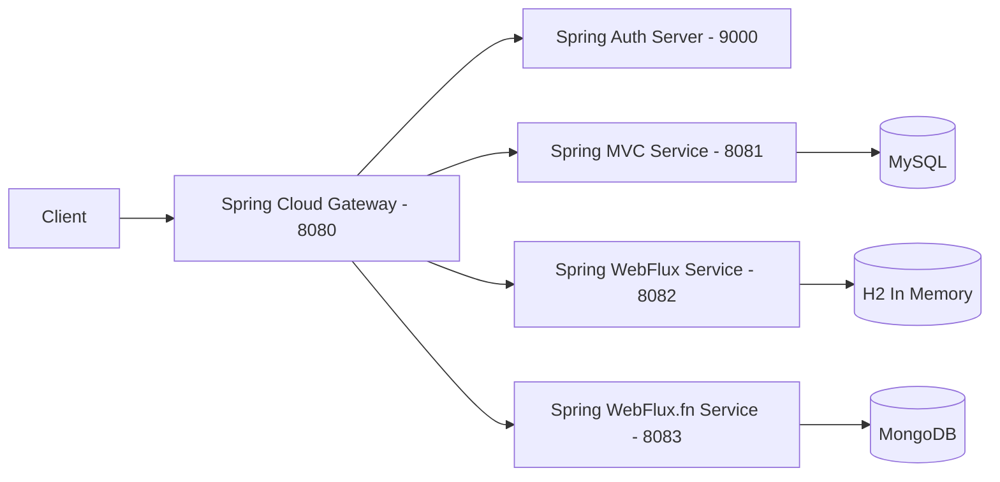

# Spring Boot 4 & Spring Framework 7

Repositório contendo os projetos desenvolvidos durante o curso **Spring Boot 4 e Spring Framework 7**, explorando desde
os fundamentos do ecossistema Spring até arquiteturas modernas com **microservices, segurança OAuth2, programação
reativa e bancos SQL/NoSQL**.

O objetivo deste repositório é apresentar **exemplos práticos e progressivos**, abordando desenvolvimento backend
moderno utilizando as versões mais recentes da plataforma Java e do ecossistema Spring.

---

## Tecnologias Utilizadas

Todos os projetos deste repositório utilizam tecnologias atualizadas do ecossistema Java:

* **Spring Framework 7** — lançado em **Novembro de 2025**
* **Spring Boot 4** — lançado em **Novembro de 2025**
* **Java SE 25 (LTS)** — lançado pela **Oracle** em **16 de Setembro de 2025**

---

## Stack Tecnológica

As aplicações exploram diferentes partes do ecossistema Spring:

* Spring MVC
* Spring WebFlux
* Spring Data JPA
* Spring Data JDBC
* Spring Data MongoDB
* Spring Security
* OAuth2 Authorization Server
* OAuth2 Resource Server
* REST APIs
* Reactive Programming
* MySQL
* Docker
* Microservices

---

## Projetos

| Project                                                   | Port | Database     | Stack                                         | URL                                                                                                                                                                        |
|-----------------------------------------------------------|------|--------------|-----------------------------------------------|----------------------------------------------------------------------------------------------------------------------------------------------------------------------------|
| [spring-7-webapp](./spring-7-webapp)                      | 8080 | N/A          | Spring MVC                                    | `/books` and `/authors`                                                                                                                                                    |
| [spring-7-di](./spring-7-di)                              | 8080 | N/A          | Spring Core                                   | `/`                                                                                                                                                                        |
| [spring-7-rest-mvc](./spring-7-rest-mvc)                  | 8081 | MySQL        | Spring MVC                                    | `/api/v1/beer` and `/api/v1/beer/{beerId}` `/api/v1/customer` and `/api/v1/customer/{customerId}`                                                                       |
| [sdjpa-spring-data-rest](./sdjpa-springdatarest)          | 8080 | H2           | Spring Data REST                              | `/api/v1`                                                                                                                                                                  |
| [spring-7-resttemplate](./spring-7-resttemplate)          | 8080 | N/A          | REST Client (RestTemplate)                    | `/api/v1/beer` and `/api/v1/beer/{beerId}`                                                                                                                                 |
| [spring-7-auth-server](./spring-7-auth-server)            | 9000 | N/A          | Spring Security / OAuth2 Authorization Server | Redirect URI: `http://127.0.0.1:8080/login/oauth2/code/oidc-client` `http://127.0.0.1:8080/authorized` Logout: `http://127.0.0.1:8080/` Login URL: `/login` |
| [spring-7-reactive-examples](./spring-7-reactive-example) | 8080 | N/A          | Spring WebFlux                                | `/`                                                                                                                                                                        |
| [spring-7-reactive](./spring-7-reactive)                  | 8082 | H2 In Memory | Spring WebFlux                                | `/api/v2/beer` and `/api/v2/beer/{beerId}` `/api/v2/customer` and `/api/v2/customer/{customerId}`                                                                       |
| [spring-7-reactive-mongo](./spring-7-reactive-mongo)      | 8083 | MongoDB      | Spring WebFlux.fn                             | `/api/v3/beer` and `/api/v3/beer/{beerId}` `/api/v3/customer` and `/api/v3/customer/{customerId}`                                                                       |
| [spring-7-webclient](./spring-7-webclient)                | 8080 | N/A          | REST Client (WebClient)                       | `/api/v3/beer` and `/api/v3/beer/{beerId}` `/api/v3/customer` and `/api/v3/customer/{customerId}`                                                                       |
| API Gateway                                               | 8080 | N/A          | Spring Cloud Gateway                          | Root: `/` (roteamento para `/api/v1`, `/api/v2`, `/api/v3`)                                                                                                                |

---

## Diagrama de Arquitetura

---

## Maven

Todos os projetos são construídos utilizando **Apache Maven**.

Cada projeto utiliza **pelo menos duas das dependências abaixo**.

---

## Dependências

| Categoria           | Dependências                                                                              |
|---------------------|-------------------------------------------------------------------------------------------|
| **Developer Tools** | Lombok Spring Boot DevTools Spring Docker Compose                                   |
| **Web**             | Spring Web MVC Spring Reactive Web (WebFlux)                                           |
| **Operations**      | Spring Boot Actuator                                                                      |
| **SQL**             | Spring Data JPA Spring Data JDBC H2 Database MySQL Driver Flyway Migration    |
| **NoSQL**           | Spring Data Reactive MongoDB                                                              |
| **I/O**             | Validation                                                                                |
| **Security**        | Spring Security OAuth2 Client OAuth2 Resource Server OAuth2 Authorization Server |
| **Testing**         | Testcontainers (JUnit Jupiter, MySQL, MongoDB)                                            |

---

## Bibliotecas Adicionais

| Biblioteca          | Descrição                                                             |
|---------------------|-----------------------------------------------------------------------|
| **MapStruct 1.6.3** | Code generator para mapeamento de DTOs                                |
| **Jackson 3.x**     | Nova geração da biblioteca de serialização JSON do ecossistema Spring |
| **OpenCSV**         | Processamento de arquivos CSV                                         |
| **Awaitility**      | Testes assíncronos                                                    |

---

## Plugins Maven

| Plugin                   | Versão     |
|--------------------------|------------|
| Maven Compiler Plugin    | **3.14.1** |
| Maven Failsafe Plugin    | **3.5.2**  |
| Lombok MapStruct Binding | **0.2.0**  |

---

## Conteúdo do Curso

O curso cobre os seguintes tópicos:

1. Introduction
2. Building a Spring Boot Web App
3. Performing Dependency Injection with Spring
4. Introduction to RESTful Web Services
5. Using Project Lombok with Spring Boot
6. Spring MVC Rest Services
7. Spring MockMVC Test with Mockito and JUnit
8. Exception Handling with Spring MVC
9. Spring Data JPA with Spring MVC
10. Data Validation with Spring
11. MySQL with Spring Boot
12. Flyway Migrations with Spring Boot
13. Using Testcontainers with Spring Boot
14. CSV File Upload
15. Query Parameters with Spring MVC
16. Paging and Sorting with Spring MVC
17. JPA Database Relationship Mapping
18. Database Transactions, Locking and Spring
19. Introduction to Spring Data REST
20. Spring RestTemplate
21. Testing Spring RestTemplate
22. Spring Security HTTP Basic Auth
23. Spring Authorization Server
24. Spring MVC OAuth2 Resource Server
25. Spring RestTemplate with OAuth2
26. Introduction to Reactive Programming with Spring
27. Spring Data R2DBC
28. Spring WebFlux Rest Services
29. Spring WebFlux WebTestClient
30. Exception Handling with Spring WebFlux
31. Spring Data MongoDB
32. Spring WebFlux.fn REST Services
33. Spring WebClient
34. Spring WebFlux Resource Server
35. Spring WebFlux.fn Resource Server
36. Using OAuth 2.0 with Spring WebClient
37. Spring Cloud Gateway
38. Spring Boot Maven Plugin
39. Spring Boot Gradle Plugin
40. OpenAPI with Spring Boot
41. OpenAPI Validation with RestAssured
42. Introduction to Spring AI
43. Spring RestClient
44. Spring Boot Actuator
45. Request Logging
46. Caching Data with Spring Framewokr
47. Spring Application Events for Auditing
48. Using your Spring Boot Skills
49. Docker with Spring Boot
50. Docker Compose with Spring Boot
51. Kubernetes with Spring Boot
52. Introduction to Spring Boot Microservices
53. Spring Boot Microservices with Apache Kafka
54. Spring Professional Certification Practice Test
55. New Spring Boot 3.4.0 Features
56. Spring Boot Engineering Best Practices
57. Appendix A: Using GitHub
58. Extra - Introduction to Junie and JetBrains AI
59. Extra - Interviews
60. Extra - Kube by Example - Building Spring Boot Docker Images
61. Extra - Kube by Example - Spring Boot on Kubernetes
62. Extra - Kube by Example - Spring Boot Microservices on Kubernetes

---

## OAuth2 Configuration

### Root URL

| Property | Value                   |
|----------|-------------------------|
| Root URL | `http://localhost:8080` |

---

### OAuth2 Client Provider

(`spring.security.client.provider`)

| Property          | Value                                    |
|-------------------|------------------------------------------|
| Authorization URI | `http://localhost:9000/oauth2/authorize` |
| Token URI         | `http://localhost:9000/oauth2/token`     |

---

### OAuth2 Resource Server

(`spring.security.oauth2.resourceserver`)

| Property       | Value                   |
|----------------|-------------------------|
| JWT Issuer URI | `http://localhost:9000` |

---

### Client Registration

(`spring.security.client.registration`)

| Property                 | Value                        |
|--------------------------|------------------------------|
| Provider                 | `springauth`                 |
| Client ID                | `oidc-client`                |
| Client Secret            | `secret`                     |
| Authorization Grant Type | `client_credentials`         |
| Scope                    | `message.read message.write` |

---

# Skills e Tecnologias

### Core

### APIs & Architecture

### Data

### Build, DevOps & Tools

### Testing

### Libraries

---

# Objetivo do Repositório

Este repositório tem como objetivo:

* Demonstrar **boas práticas no desenvolvimento com Spring**
* Explorar **novas features do Spring Framework 7**
* Apresentar **Spring Boot 4 com Java 25**
* Servir como **material de referência para estudos**
* Fornecer **exemplos práticos de APIs modernas**

---

# Licença

Este projeto é destinado para **fins educacionais**.
