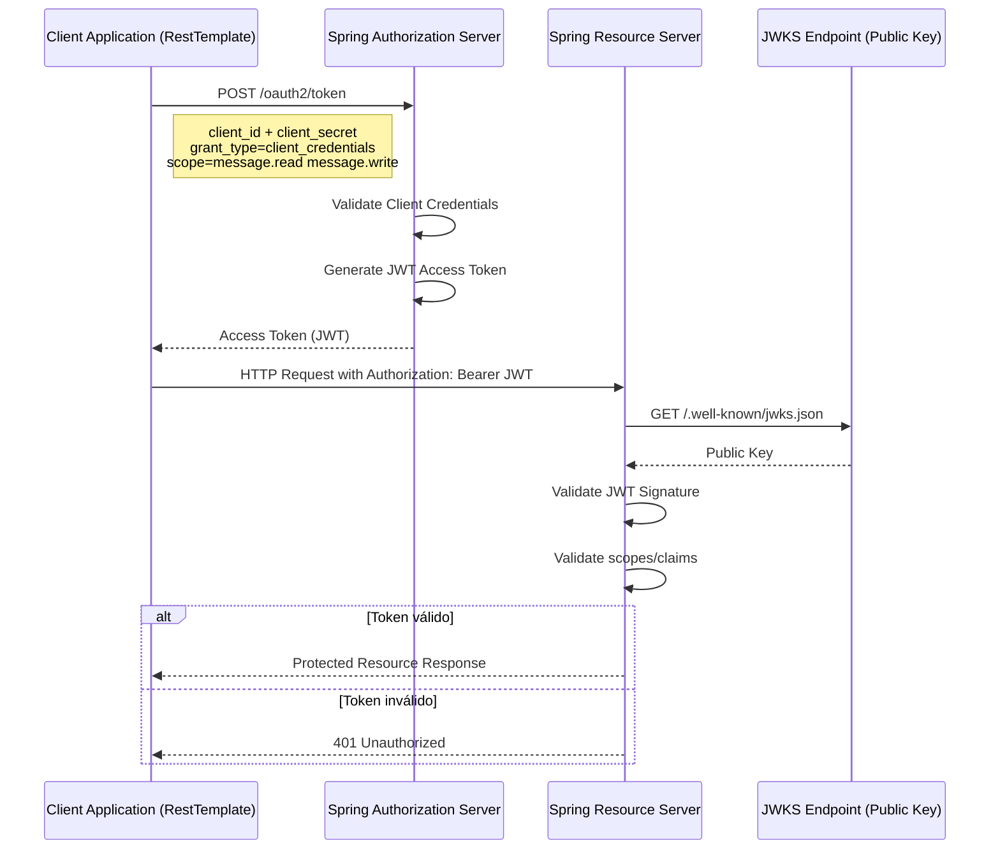
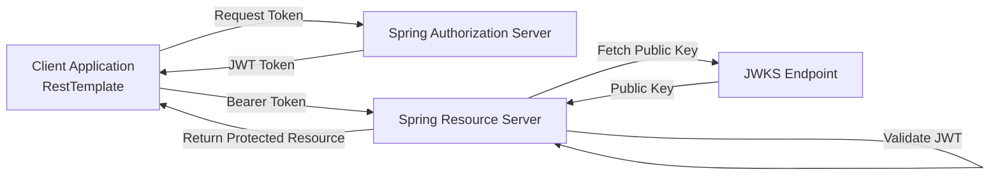

# Fluxo OAuth2 Completo

Abaixo está o **mapeamento completo do fluxo OAuth2 com Spring Authorization Server + Resource Server + RestTemplate**,
conforme a arquitetura apresentada no curso **Spring Boot 4, Spring Framework 7: Beginner to Guru**.
O fluxo representa o uso do **Client Credentials Flow** com **JWT**.

# Fluxo OAuth2 Completo (Authorization Server + Resource Server + RestTemplate)



# Explicação Técnica do Fluxo

## 1. Requisição de Token (Client Credentials Flow)

A aplicação cliente utiliza **RestTemplate** para solicitar um token ao **Authorization Server**.

Endpoint padrão:

```
POST /oauth2/token
```

Parâmetros enviados:

```
grant_type=client_credentials
client_id=messaging-client
client_secret=secret
scope=message.read message.write
```

O **Authorization Server**:

1. Valida o `client_id`
2. Valida o `client_secret`
3. Verifica os scopes permitidos
4. Gera um **JWT Access Token**

## 2. Geração do JWT

O **Authorization Server** assina o token usando **criptografia assimétrica (RSA)**.

Estrutura do token:

```
Header.Payload.Signature
```

Componentes:

| Parte     | Conteúdo                      |
|-----------|-------------------------------|
| Header    | algoritmo e tipo do token     |
| Payload   | claims (sub, scope, exp, iss) |
| Signature | assinatura com chave privada  |

Especificação formal:

* RFC 7519

## 3. Chaves Públicas (JWKS Endpoint)

O **Authorization Server** expõe a chave pública através do endpoint:

```
/.oauth2/jwks
ou
/.well-known/jwks.json
```

O **Resource Server** consulta esse endpoint para validar tokens.

## 4. Acesso ao Resource Server

Após receber o token, o cliente chama a API protegida:

```
GET /api/messages
Authorization: Bearer <JWT>
```

## 5. Validação do Token no Resource Server

O **Resource Server** executa os seguintes passos:

1. Extrai o token do header `Authorization`
2. Obtém a chave pública do Authorization Server
3. Verifica a assinatura do JWT
4. Valida:

    * expiração
    * issuer
    * scopes
5. Converte scopes em **authorities do Spring Security**

## 6. Autorização baseada em Scope

Exemplo de autorização:

```
SCOPE_message.read
SCOPE_message.write
```

Configuração típica no Resource Server:

```java

@PreAuthorize("hasAuthority('SCOPE_message.read')")
@GetMapping("/messages")
public List<Message> getMessages() {
    // ...
}
```

# Arquitetura Geral



# Componentes Spring Envolvidos

| Componente                  | Função                               |
|-----------------------------|--------------------------------------|
| Spring Authorization Server | Emite tokens OAuth2                  |
| Spring Security             | Controle de autenticação/autorização |
| JWT Decoder                 | Valida tokens                        |
| JWKSource                   | Geração das chaves                   |
| Resource Server             | Protege APIs                         |
| RestTemplate                | Cliente HTTP que obtém token         |

---

# Fluxo Completo Resumido

1. Cliente solicita token ao Authorization Server
2. Authorization Server valida credenciais
3. JWT é gerado e assinado
4. Cliente chama API protegida com Bearer Token
5. Resource Server obtém chave pública
6. JWT é validado
7. API retorna o recurso protegido

# Diferenças de Versões (Importante para o Curso)

| Tecnologia       | Curso (Original) | Stack Atual     |
|------------------|------------------|-----------------|
| Spring Framework | 6.x              | **7.x**         |
| Spring Boot      | 3.x              | **4.x**         |
| Java             | 17               | **Java 25 LTS** |
| Jackson          | 2.x              | **Jackson 3.x** |

Mudanças relevantes:

### 1. Spring Security

* Configuração **DSL baseada em lambda** passou a ser o padrão.
* Métodos antigos de configuração foram **deprecated**.

Exemplo novo padrão:

```java
http.oauth2ResourceServer(oauth2 ->
  oauth2.

jwt(Customizer.withDefaults())
  );
```

### 2. Spring Authorization Server

Versões recentes adicionaram:

* suporte completo a **OAuth 2.1**
* melhorias em **token introspection**
* melhor integração com **OpenID Connect**

### 3. RestTemplate

Importante:

* **RestTemplate está em manutenção**
* Spring recomenda **WebClient**

Mas o curso usa **RestTemplate** por simplicidade.
