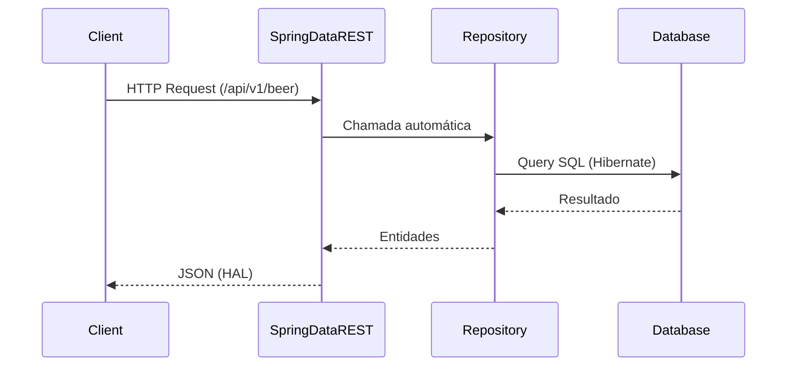
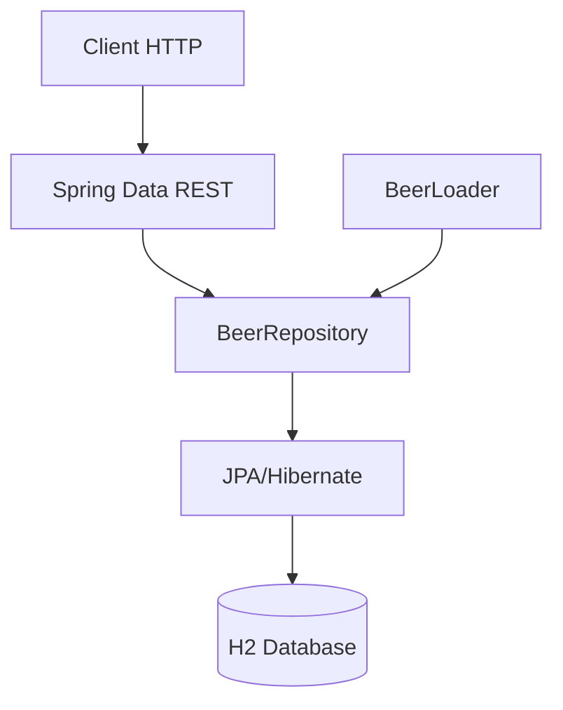

# 🍺 SDJPA - Spring Data REST com JPA


## 📌 Descrição

Projeto desenvolvido durante o curso **Spring Boot 4, Spring Framework 7: Beginner to Guru (Udemy)**, na seção *
*Introduction to Spring Data REST**.

A aplicação demonstra como utilizar o **Spring Data REST** para expor automaticamente endpoints REST a partir de
repositórios JPA, eliminando a necessidade de criação manual de controllers.

O projeto gerencia um catálogo de cervejas 🍺, incluindo persistência em banco de dados e exposição automática de APIs
RESTful.

## 🚀 Funcionalidades

- 📦 Exposição automática de endpoints REST via Spring Data REST
- 🔍 Busca por:
    - Nome da cerveja
    - Estilo (IPA, STOUT, etc.)
    - Nome + Estilo
    - UPC
- 📄 Paginação automática
- 🧠 Persistência com JPA/Hibernate
- 🗃️ Banco em memória (H2)
- ⚡ Carga inicial de dados automática (bootstrap)

## 📋 Pré-requisitos

Antes de iniciar, você precisa ter instalado:

- ☕ Java 25
- 📦 Maven 3.9+
- 🧠 Conhecimento básico em:
    - Spring Boot
    - JPA
    - REST APIs

## ⚙️ Instalação

```bash
# Clone o repositório
git clone https://github.com/JuhMaran/spring-boot-4-spring-framewor-7.git

# Acesse a pasta do projeto
cd spring-boot-4-spring-framewor-7/sdjpa-springdatarest

# Compile o projeto
mvn clean install

# Execute a aplicação
mvn spring-boot:run
````

A aplicação será iniciada em:

```
http://localhost:8080
```

Base path da API:

```
http://localhost:8080/api/v1
```

## 🧰 Tecnologias Utilizadas

* ☕ Java 25
* 🌱 Spring Boot 4
* 📦 Spring Data JPA
* 🌐 Spring Data REST
* 🛢️ H2 Database
* 🔁 Hibernate
* 🧩 Lombok
* 🔄 MapStruct
* 📊 Spring Actuator

## 🧪 Como Usar

### 🔎 Listar cervejas

```bash
curl --location 'http://localhost:8080/api/v1/beer'
```

### 🔍 Buscar endpoints disponíveis

```bash
curl --location 'http://localhost:8080/api/v1/beer/search'
```

### 🔎 Buscar por UPC

```bash
curl --location 'http://localhost:8080/api/v1/beer/search/findByUpc?upc=0631234200036'
```

### 🔎 Buscar por nome

```bash
curl --location 'http://localhost:8080/api/v1/beer/search/findAllByBeerName?beerName=Mango Bobs'
```

### 🔎 Buscar por estilo

```bash
curl --location 'http://localhost:8080/api/v1/beer/search/findAllByBeerStyle?beerStyle=IPA'
```

## 🧭 Fluxo

### Fluxo de requisição (Spring Data REST)



## 🏗️ Arquitetura

### Arquitetura baseada em Repository REST



## 📊 Endpoints

| Endpoint                                            | Descrição                  |
|-----------------------------------------------------|----------------------------|
| `/api/v1/beer`                                      | Lista todas as cervejas    |
| `/api/v1/beer/{id}`                                 | Busca cerveja por ID       |
| `/api/v1/beer/search`                               | Lista queries disponíveis  |
| `/api/v1/beer/search/findByUpc`                     | Busca por UPC              |
| `/api/v1/beer/search/findAllByBeerName`             | Busca por nome             |
| `/api/v1/beer/search/findAllByBeerStyle`            | Busca por estilo           |
| `/api/v1/beer/search/findAllByBeerNameAndBeerStyle` | Busca combinada            |
| `/actuator`                                         | Monitoramento da aplicação |

## 📚 Documentação e Recursos

Esta seção centraliza links e materiais complementares do projeto.

### 📖 Wiki

- Wiki: [Introduction to Spring Data REST](https://github.com/JuhMaran/spring-boot-4-spring-framewor-7/wiki/Section-19-Introduction-to-Spring-Data-REST)

### 🌐 Documentação Externa

- Curso: *Spring Boot 4, Spring Framework 7: Beginner to Guru*
- Seção: *Introduction to Spring Data REST*

### 🔗 Repositório

- GitHub: [sdjpa-springdatarest](https://github.com/JuhMaran/spring-boot-4-spring-framewor-7/tree/main/sdjpa-springdatarest)

### 📦 Collections (Postman / Insomnia)

- Postman: [Collections](collection/SDJPA.postman_collection.json)

### 📑 OpenAPI / Swagger

❌ Não implementado.

### 🧪 Testes

❌ Não implementado.

### 📂 Outros Arquivos Importantes

- `pom.xml` → Gerenciamento de dependências Maven
- `application.yaml` → Configurações da aplicação
- `BeerLoader.java` → Carga inicial de dados
- `BeerRepository.java` → Exposição automática dos endpoints REST

## 📌 Status do Projeto

✅ **Concluído**

## 🤝 Contribuição

Contribuições são sempre bem-vindas!

1. Faça um fork do projeto
2. Crie uma branch:

    ```bash
    git checkout -b minha-feature
    ```

3. Commit suas mudanças:

    ```bash
    git commit -m 'Minha nova feature'
    ```

4. Push:

    ```bash
    git push origin minha-feature
    ```

5. Abra um Pull Request 🚀

## ♿ Acessibilidade

* Diagramas feitos com **Mermaid** (compatível com GitHub)
* Estrutura organizada com títulos claros
* Uso moderado de emojis para melhor leitura visual

## 📄 Licença

Este projeto está licenciado sob a **Apache License 2.0**.

Veja o arquivo [LICENSE](https://www.apache.org/licenses/LICENSE-2.0.txt) para mais detalhes.

## 👩‍💻 Autora

Desenvolvido por **Juh Maran**
🔗 [https://github.com/JuhMaran](https://github.com/JuhMaran)

