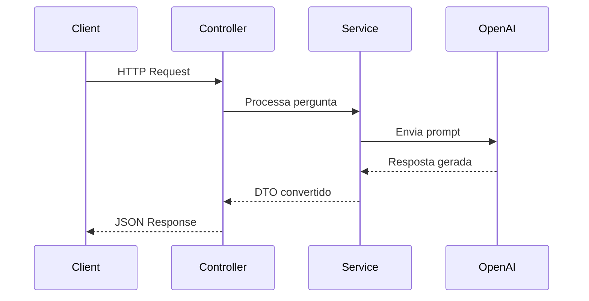
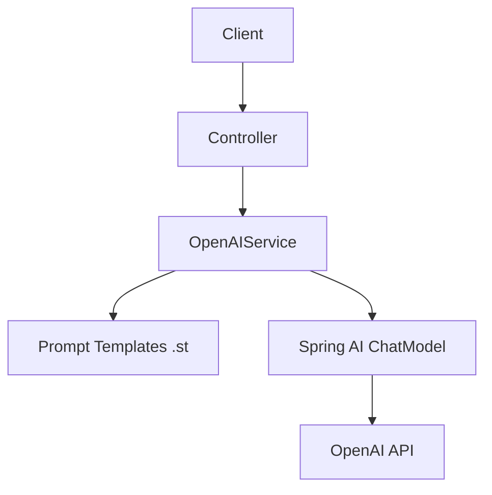

# 🤖 Spring AI Introduction - OpenAI Integration


## 📌 Descrição

O **Spring AI Introduction** é uma aplicação de exemplo que demonstra a integração entre **Spring Boot** e **Spring AI** utilizando modelos da OpenAI.

O projeto foi desenvolvido com foco educacional, seguindo um curso prático, com o objetivo de:

- Demonstrar como consumir modelos de IA via API
- Trabalhar com prompts dinâmicos
- Converter respostas da IA para objetos Java

⚠️ **Observação importante:**  
Devido à necessidade de uma conta paga para uso da API da OpenAI, **não foi possível executar testes reais via Postman**. 
A implementação segue corretamente o padrão proposto no curso.

## 🚀 Funcionalidades

- 🤖 Integração com modelos da OpenAI via Spring AI
- 🧠 Geração de respostas baseadas em prompts dinâmicos
- 🌍 Consulta de capitais de países/estados
- 📊 Retorno estruturado com informações adicionais (população, região, idioma, moeda)
- 🔄 Conversão automática de respostas para objetos Java (DTOs)
- 🧩 Uso de templates `.st` para prompts reutilizáveis

## 📋 Pré-requisitos

Antes de executar o projeto, você precisa:

- ☕ Java 25
- 📦 Maven 3.9+
- 🔑 Uma chave de API da OpenAI

Configurar variável de ambiente:

```bash
export OPENAI_API_KEY=your_api_key_here
````

## ⚙️ Instalação

```bash
# Clone o repositório
git clone https://github.com/JuhMaran/spring-boot-4-spring-framewor-7.git

# Acesse o módulo
cd spring-boot-4-spring-framewor-7/spring-7-ai-intro

# Compile o projeto
mvn clean install

# Execute a aplicação
mvn spring-boot:run
```

A aplicação estará disponível em:

```
http://localhost:8080
```

## 🧰 Tecnologias Utilizadas

* Java 25
* Spring Boot 4.1 (Snapshot)
* Spring AI
* OpenAI API
* Maven

## 🧪 Como Usar

### Obter capital (simples)

```bash
curl -X POST http://localhost:8080/capital \
-H "Content-Type: application/json" \
-d '{"stateOrCountry": "Brazil"}'
```

### Obter capital com informações detalhadas

```bash
curl -X POST http://localhost:8080/capitalWithInfo \
-H "Content-Type: application/json" \
-d '{"stateOrCountry": "France"}'
```

### Fazer uma pergunta livre

```bash
curl -X POST http://localhost:8080/ask \
-H "Content-Type: application/json" \
-d '{"question": "What is Artificial Intelligence?"}'
```

## 🧠 Fluxo de Funcionamento



## 🏗️ Arquitetura



## ⚠️ Limitações

* ❌ Não foi possível validar chamadas reais à API (necessário plano pago OpenAI)
* ⚠️ Testes automatizados dependem de integração externa
* 📡 Dependência de conexão com API externa

## 📌 Status do Projeto

✅ Concluído

## 🤝 Contribuição

Contribuições são bem-vindas! 💡

1. Faça um fork do projeto
2. Crie uma branch:

    ```bash
    git checkout -b minha-feature
    ```

3. Commit:

    ```bash
    git commit -m "feat: nova funcionalidade"
    ```

4. Push:

    ```bash
    git push origin minha-feature
    ```

5. Abra um Pull Request 🚀

## ♿ Acessibilidade

* Diagramas feitos com **Mermaid** (compatível com GitHub)
* Estrutura organizada com headings semânticos
* Prompts documentados para melhor entendimento
* Uso moderado de emojis para apoio visual

## 📄 Licença

Este projeto está licenciado sob a **Apache License 2.0**.

🔗 [https://www.apache.org/licenses/LICENSE-2.0.txt](https://www.apache.org/licenses/LICENSE-2.0.txt)

## 👩‍💻 Autora

Desenvolvido por **Juh Maran**  
🔗 [https://github.com/JuhMaran](https://github.com/JuhMaran)