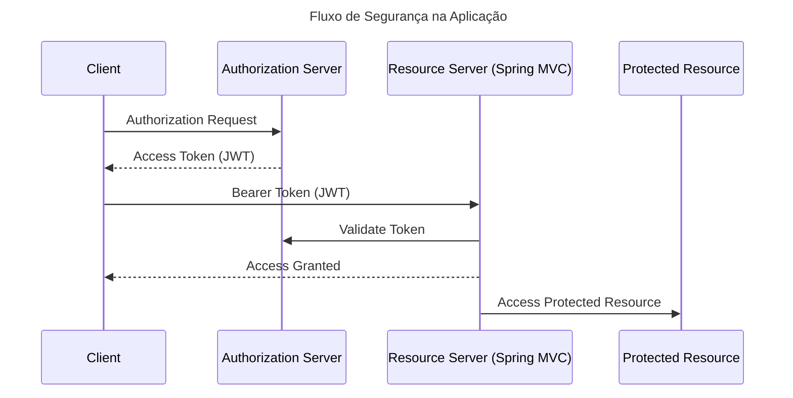

# Spring 7 - Auth Server

## OAuth2 e JWT — Visão Geral

Este documento descreve os conceitos fundamentais de **OAuth 2** e **JWT (JSON Web Token)** utilizados na aplicação.
Esses mecanismos são amplamente adotados em arquiteturas modernas de **APIs REST** para autenticação e autorização
seguras.

---

## OAuth 2

### O que é OAuth 2

**OAuth 2** é um **framework de autorização** utilizado para conceder **acesso limitado a recursos protegidos** sem
expor diretamente as credenciais do usuário.

Ele é amplamente utilizado por grandes plataformas como:

* Google
* Facebook
* GitHub

Um exemplo comum de uso é o recurso **"Sign in with Google"** ou **"Sign in with Facebook"**, que permite que uma
aplicação de terceiros acesse determinados recursos **em nome do usuário**, sem receber diretamente seu **username e
password**.

---

## Papéis no OAuth 2

O protocolo OAuth define quatro papéis principais:

| Papel                    | Descrição                                                               |
|--------------------------|-------------------------------------------------------------------------|
| **Resource Owner**       | Usuário que concede acesso ao recurso                                   |
| **Client**               | Aplicação que solicita acesso ao recurso                                |
| **Resource Server**      | Servidor que hospeda os recursos protegidos                             |
| **Authorization Server** | Servidor responsável por autenticar o usuário e emitir tokens de acesso |

---

## Fluxo Abstrato do OAuth 2

O fluxo básico de autorização segue as etapas abaixo:

1. **Application (Client)** envia uma **Authorization Request** para o **Resource Owner**
2. **Resource Owner** concede autorização (**Authorization Grant**)
3. **Application (Client)** envia o **Authorization Grant** para o **Authorization Server**
4. **Authorization Server** valida a identidade e retorna um **Access Token**
5. **Application (Client)** envia o **Access Token** para o **Resource Server**
6. **Resource Server** valida o token
7. Se o token for válido, o **Resource Server** concede acesso ao recurso

---

## Tipos de Fluxos de Autorização OAuth 2

OAuth 2 define vários fluxos de autorização para diferentes tipos de aplicações.

| Fluxo                                 | Descrição                                       |
|---------------------------------------|-------------------------------------------------|
| **Authorization Code Flow**           | Utilizado por aplicações web server-side        |
| **Client Credentials Flow**           | Utilizado por comunicação entre serviços        |
| **Resource Owner Password Flow**      | Utilizado por aplicações altamente confiáveis   |
| **Implicit Flow**                     | Utilizado principalmente por aplicações SPA     |
| **Hybrid Flow**                       | Combinação de fluxos para aplicações complexas  |
| **Device Authorization Flow**         | Utilizado por dispositivos com entrada limitada |
| **Authorization Code Flow with PKCE** | Versão mais segura do Authorization Code Flow   |

---

## Fluxo Utilizado Nesta Aplicação

Esta aplicação utiliza:

### Client Credentials Flow com JWT

Nesse fluxo:

1. A **aplicação cliente** solicita autorização ao **Authorization Server**
2. O **Authorization Server** valida a requisição
3. O servidor emite um **Access Token (JWT)**
4. O **Client** envia o token ao **Resource Server**
5. O **Resource Server** valida o token
6. Se válido, o acesso ao recurso é concedido

Esse fluxo é muito comum em **integrações entre serviços e APIs REST**.

---

## JWT (JSON Web Token)

### O que é JWT

**JWT (JSON Web Token)** é um padrão aberto definido pela especificação: **RFC 7519**

Ele define um formato compacto e seguro para transmitir informações entre partes como um objeto JSON.

Em APIs REST, o JWT é utilizado como **Access Token**.

---

## REST e Stateless

Protocolos **HTTP / REST são stateless**, ou seja:

- Cada requisição deve conter todas as informações necessárias
- Não há armazenamento de sessão no servidor

Isso difere de aplicações web tradicionais que utilizam:

- **Session IDs**
- **Cookies**

O **JWT resolve esse problema**, carregando as informações necessárias diretamente no token.

---

## Estrutura do JWT

Um token JWT possui **três partes**:

* Header (cabeçalho)
* Payload (data) (carga útil)
* Signature (assinatura)

| Parte         | Descrição                                        |
|---------------|--------------------------------------------------|
| **Header**    | Metadados do token (algoritmo, tipo)             |
| **Payload**   | Informações do usuário e permissões              |
| **Signature** | Assinatura criptográfica que garante integridade |

Essas partes são codificadas usando **Base64**.

---

## Informações Contidas no Token

O **Payload do JWT** pode conter:

- Identidade do usuário
- Permissões
- Scopes de autorização
- Tempo de expiração
- Metadados de autenticação

---

## Assinatura de Tokens JWT

Os tokens JWT são **assinados** para evitar alterações maliciosas.

Existem duas abordagens principais.

---

## Criptografia Simétrica

Utiliza **uma única chave secreta**.

### Características

- A mesma chave é usada para assinar e validar
- Mais simples
- Requer compartilhamento da chave entre serviços

### Desvantagem

Compartilhar a chave aumenta o **risco de segurança**.

---

## Criptografia Assimétrica

Utiliza **par de chaves (Key Pair)**:

- **Private Key**
- **Public Key**

### Funcionamento

| Chave           | Uso                        |
|-----------------|----------------------------|
| **Private Key** | Gera a assinatura do token |
| **Public Key**  | Verifica a assinatura      |

A **Private Key nunca é compartilhada**.

A **Public Key pode ser distribuída para outros serviços**.

Essa é a abordagem mais utilizada em arquiteturas modernas de APIs.

---

## Verificação do Token JWT

O processo de validação ocorre da seguinte forma:

1. O **Authorization Server** gera o JWT e o assina usando a **Private Key**
2. O **Resource Server** solicita a **Public Key**
3. O **Resource Server** valida a assinatura do token
4. Se a assinatura for válida, o acesso ao recurso é concedido

---

## Cache da Public Key

Para melhorar desempenho:

- O **Resource Server pode armazenar a Public Key em cache**

Assim:

- Tokens podem ser validados localmente
- Não é necessário consultar o **Authorization Server** a cada requisição

Isso reduz significativamente a latência e a carga do sistema.

---

## OAuth 2 vs HTTP Basic Authentication

### HTTP Basic Authentication

Funciona enviando `username:password` em cada requisição.

**Problemas**

- Credenciais enviadas em todas as requisições
- Base64 não é criptografia
- Vulnerável se não usar HTTPS
- Não possui conceito nativo de permissões

### OAuth 2

OAuth resolve esses problemas.

**Vantagens**

- Credenciais são compartilhadas **apenas com o Authorization Server**
- APIs recebem apenas **tokens**
- Tokens podem ter **expiração**
- Permissões são definidas usando **Scopes**
- Melhor separação de responsabilidades

---

## Scopes

Em OAuth 2, permissões são definidas usando **Scopes**.

Exemplos:

* read
* write
* admin
* profile
* orders.read
* orders.write

Scopes permitem que o **Resource Server** determine:

- Quais recursos o cliente pode acessar
- Quais operações são permitidas

---

# Fluxo de Segurança na Aplicação

Arquitetura utilizada neste projeto:

---

# Stack Tecnológica

Este projeto utiliza:

- **Java 25 LTS**
- **Spring Framework 7**
- **Spring Boot 4**
- **Spring Authorization Server**
- **Spring Security**
- **JWT (RFC 7519)**

---

# Conclusão

O uso de **OAuth 2 com JWT** oferece:

- Melhor segurança
- Escalabilidade
- Arquitetura stateless
- Separação entre autenticação e acesso a recursos

Esse modelo é atualmente **o padrão da indústria para proteção de APIs REST**.

---

# Referências

- [Spring Authorization Server Reference](https://docs.spring.io/spring-authorization-server/reference/index.html)
- [Overview](https://docs.spring.io/spring-authorization-server/reference/overview.html)
- [JSON Web Token (JWT) — RFC 7519](https://datatracker.ietf.org/doc/html/rfc7519)
- [Getting Started](https://docs.spring.io/spring-authorization-server/reference/getting-started.html)