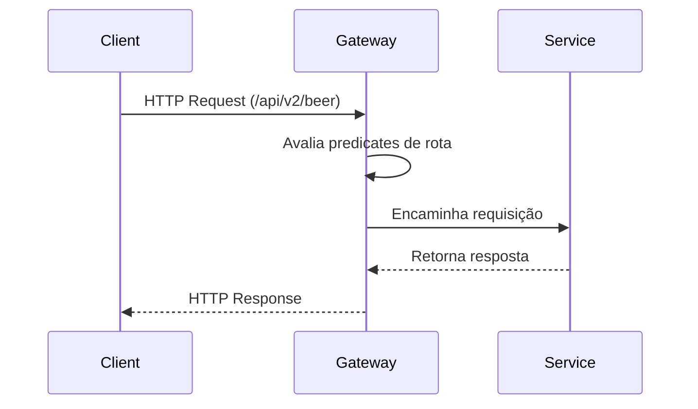

# Spring 7 - API Gateway

## Tecnologias

- Java 25
- Spring Framework 7
- Spring Boot 4.0.4
- Reactive Gateway (Spring Cloud Routing) 2025.1.0
- OAuth2 Resource Server (Security)
- Spring Boot Actuator (OPS)
- Logging
    - Zalando 4.0.3: Logbook, Logstash e Netty
    - Logstash Logback 9.0

---

| API Version | Serviço Destino           | Porta |
|-------------|---------------------------|-------|
| `/api/v1/*` | `spring-7-rest-mvc`       | 8081  |
| `/api/v2/*` | `spring-7-reactive`       | 8082  |
| `/api/v3/*` | `spring-7-reactive-mongo` | 8083  |

---

## Fluxo de Processamento da Requisição

Quando uma requisição é enviada para o Gateway, ocorre o seguinte fluxo:



1. O cliente envia uma requisição HTTP para o Gateway
2. O Gateway analisa os predicates configurados
3. A rota correspondente é selecionada
4. A requisição é encaminhada ao serviço backend
5. A resposta retorna ao cliente através do Gateway

---

## Actuator

### Request

* **cURL**
* GET `/actuator`

```
curl --location 'http://localhost:8080/actuator'
```

### Response

* **Status Code:** 200 OK
* **Response Body**

```json
{
  "_links": {
    "self": {
      "href": "http://localhost:8080/actuator",
      "templated": false
    },
    "health": {
      "href": "http://localhost:8080/actuator/health",
      "templated": false
    },
    "health-path": {
      "href": "http://localhost:8080/actuator/health/{*path}",
      "templated": true
    }
  }
}
```

---

Building image 'docker.io/library/spring-7-gateway:0.0.1-SNAPSHOT'