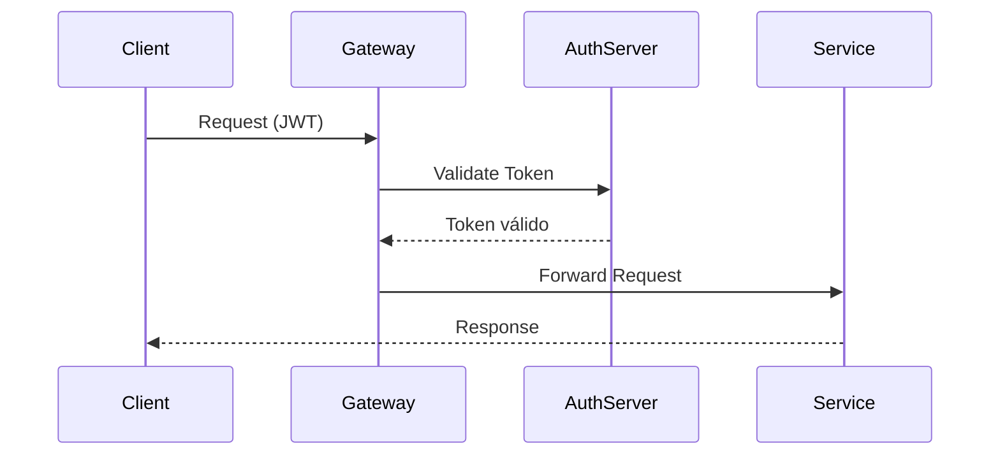
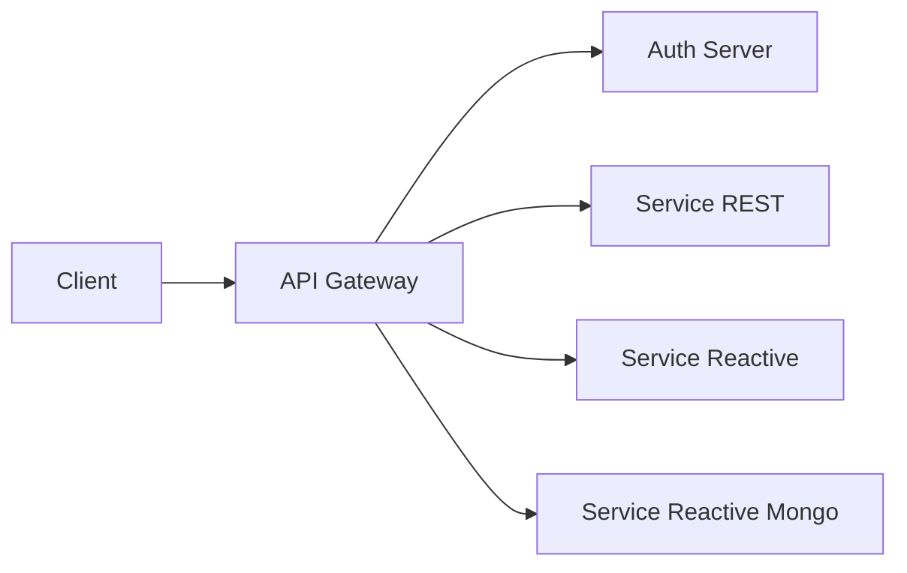

# 🌐 API Gateway - Spring 7


## 📌 Descrição

O **API Gateway** é um componente central de roteamento e segurança em uma arquitetura de microsserviços, construído com
**Spring Cloud Gateway (WebFlux)**.

Ele atua como ponto único de entrada (Entry Point), sendo responsável por:

- Encaminhar requisições para os serviços corretos
- Aplicar autenticação via OAuth2 Resource Server
- Centralizar logs e observabilidade

Este projeto foi criado para demonstrar uma abordagem moderna com **Spring Boot 4 + Spring Cloud + Security JWT**.

## 🚀 Funcionalidades

- 🌐 Roteamento dinâmico de requisições (API Gateway)
- 🔐 Proteção com OAuth2 Resource Server (JWT)
- 📡 Integração com Authorization Server
- 📊 Monitoramento com Actuator
- 🧾 Logs estruturados (JSON) com Logbook + Logstash
- ⚡ Arquitetura reativa com WebFlux
- 🧭 Suporte a múltiplos serviços backend

## 📋 Pré-requisitos

Antes de iniciar, você precisa ter instalado:

- ☕ Java 25
- 📦 Maven 3.9+
- 🧠 Conhecimento em:
    - Spring Cloud Gateway
    - OAuth2 / JWT
    - Arquitetura de microsserviços

## ⚙️ Instalação

```bash
# Clone o repositório
git clone https://github.com/JuhMaran/spring-boot-4-spring-framewor-7.git

# Acesse o módulo gateway
cd spring-boot-4-spring-framewor-7/spring-7-gateway

# Compile o projeto
mvn clean install

# Execute a aplicação
mvn spring-boot:run
````

A aplicação estará disponível em:

```
http://localhost:8080
```

## 🧰 Tecnologias Utilizadas

* Java 25
* Spring Boot 4
* Spring Cloud Gateway
* Spring Security (OAuth2 Resource Server)
* WebFlux (Reactive)
* Logbook (Zalando)
* Logstash Encoder
* Maven

## 🧪 Como Usar

### 🔍 Actuator

```bash
curl http://localhost:8080/actuator
```

### 🔐 Autenticação

Este gateway valida tokens JWT emitidos pelo **Auth Server**:

```
http://localhost:9000
```

### 🌐 Rotas Disponíveis

| Rota Gateway | Serviço Destino        |
|--------------|------------------------|
| `/api/v1/**` | REST MVC Service       |
| `/api/v2/**` | Reactive Service       |
| `/api/v3/**` | Reactive Mongo Service |
| `/oauth2/**` | Auth Server            |

### 📌 Exemplo de requisição

```bash
curl http://localhost:8080/api/v1/resource \
--header "Authorization: Bearer <TOKEN>"
```

## 🧭 Fluxo de Requisição



## 🏗️ Arquitetura



## 🔐 Segurança

* OAuth2 Resource Server configurado
* Validação de JWT via `issuer-uri`
* Rotas públicas:
    * `/oauth2/**`
* Demais rotas exigem autenticação

## 📊 Observabilidade

* Actuator habilitado (liveness/readiness)
* Logs estruturados em JSON
* Integração com Logstash

## ⚠️ Observação Importante

❗ Este módulo **não possui testes automatizados** no momento.

## 📌 Status do Projeto

🚧 Em desenvolvimento

## 🤝 Contribuição

Contribuições são bem-vindas! 💡

1. Fork do projeto
2. Crie uma branch:
    ```bash
    git checkout -b minha-feature
    ```
3. Commit:
    ```bash
    git commit -m "feat: nova funcionalidade"
    ```
4. Push:
    ```bash
    git push origin minha-feature
    ```
5. Abra um Pull Request 🚀

## ♿ Acessibilidade

* Diagramas utilizam **Mermaid** (renderização nativa no GitHub)
* Estrutura semântica com headings claros
* Uso moderado de emojis para facilitar leitura

## 📄 Licença

Este projeto está licenciado sob a **Apache License 2.0**.

🔗 [https://www.apache.org/licenses/LICENSE-2.0.txt](https://www.apache.org/licenses/LICENSE-2.0.txt)

## 👩‍💻 Autora

Desenvolvido por **Juh Maran**  
🔗 [https://github.com/JuhMaran](https://github.com/JuhMaran)