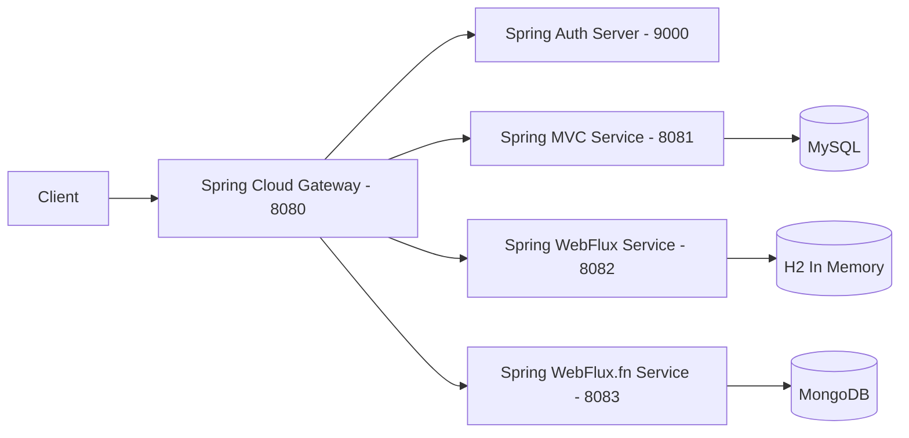

# Spring 7 - Reactive Mongo

## Tecnologias

- Spring Framework 7 (Nov/2025)
- Spring Boot 4 (Nov/2025)
- Java SE 25 LTS (Oracle — 16/09/2025)
- Spring Reactive Web (WebFlux) 4.0.3
- Spring Data Mongo Reactive (NoSQL)
- Validation (I/O)
- Docker Compose Support (Developer Tools)
- Project Lombok 1.18.42 (Developer Tools)
- MapStruct 1.6.3 (Nov/2024)
- Testcontainers (Testing)
- Awaitility
- Jackson 3.1.0 (tools.jackson.core) (Feb/2026)

---

## Endpoints - /beer

| Method | URL                   | Status Code - Success | Status Code - Error                |
|:-------|:----------------------|:----------------------|:-----------------------------------|
| GET    | /api/v3/beer          | 200 OK                | -                                  |
| GET    | /api/v3/beer/{beerId} | 200 OK                | 404 Not Found                      |
| POST   | /api/v3/beer          | 201 Created           | 400 Bad Request                    |
| PUT    | /api/v3/beer/{beerId} | 204 No Content        | 400 Bad Request   404 Not Found |
| PATCH  | /api/v3/beer/{beerId} | 204 No Content        | 400 Bad Request   404 Not Found |
| DELETE | /api/v3/beer/{beerId} | 204 No Content        | 404 Not Found                      |

---

## Endpoints - /customer

| Method | URL                           | Status Code - Success | Status Code - Error                |
|:-------|:------------------------------|:----------------------|:-----------------------------------|
| GET    | /api/v3/customer              | 200 OK                | -                                  |
| GET    | /api/v3/customer/{customerId} | 200 OK                | 404 Not Found                      |
| POST   | /api/v3/customer              | 201 Created           | 400 Bad Request                    |
| PUT    | /api/v3/customer/{customerId} | 204 No Content        | 400 Bad Request   404 Not Found |
| PATCH  | /api/v3/customer/{customerId} | 204 No Content        | 400 Bad Request   404 Not Found |
| DELETE | /api/v3/customer/{customerId} | 204 No Content        | 404 Not Found                      |

---

## Nota de Atualização de Versão (Spring Boot 4 / Spring Framework 7)

Na implementação atual utilizando **Spring Boot 4**, o starter de segurança para Resource Server possui o artefato:

`spring-boot-starter-security-oauth2-resource-server`

Essa alteração reflete ajustes na organização dos starters introduzidos nas versões mais recentes do ecossistema Spring.
Entretanto, funcionalmente, o objetivo permanece o mesmo: **habilitar suporte ao OAuth2 Resource Server no Spring
Security**.

---

## Documentação - Wiki

- [Uso de Comandos MongoDB em Ambiente Docker](https://github.com/JuhMaran/spring-boot-4-spring-framewor-7/wiki/Technical-Guide:-Using-MongoDB-Commands-in-a-Docker-Environment)
- [Configuração do Spring com MongoDB usando MongoDB Compass](https://github.com/JuhMaran/spring-boot-4-spring-framewor-7/wiki/Spring-MongoDB-Config)
- [Collection Postman](../docs/postman_collection/V02_SFG_Brewery_API.postman_collection.json)

# Quadro de Projetos para README.md

| Project (me)               | Port | Database     | Stack                                         | URL                                                                                                                                                                        |
|----------------------------|------|--------------|-----------------------------------------------|----------------------------------------------------------------------------------------------------------------------------------------------------------------------------|
| spring-7-webapp            | 8080 | N/A          | Spring MVC                                    | `/books` and `/authors`                                                                                                                                                    |
| spring-7-di                | 8080 | N/A          | Spring Core                                   | `/`                                                                                                                                                                        |
| sdjpa-spring-data-rest     | 8080 | H2           | Spring Data REST                              | `/api/v1`                                                                                                                                                                  |
| spring-7-resttemplate      | 8080 | N/A          | REST Client (RestTemplate)                    | `/api/v1/beer` and `/api/v1/beer/{beerId}`                                                                                                                                 |
| spring-7-reactive-examples | 8080 | N/A          | Spring WebFlux                                | `/`                                                                                                                                                                        |
| spring-7-webclient         | 8080 | N/A          | REST Client (WebClient)                       | `/api/v3/beer` and `/api/v3/beer/{beerId}` `/api/v3/customer` and `/api/v3/customer/{customerId}`                                                                       |
| spring-7-rest-mvc          | 8081 | MySQL        | Spring MVC                                    | `/api/v1/beer` and `/api/v1/beer/{beerId}` `/api/v1/customer` and `/api/v1/customer/{customerId}`                                                                       |
| spring-7-auth-server       | 9000 | N/A          | Spring Security / OAuth2 Authorization Server | Redirect URI: `http://127.0.0.1:8080/login/oauth2/code/oidc-client` `http://127.0.0.1:8080/authorized` Logout: `http://127.0.0.1:8080/` Login URL: `/login` |
| spring-7-reactive          | 8082 | H2 In Memory | Spring WebFlux                                | `/api/v2/beer` and `/api/v2/beer/{beerId}` `/api/v2/customer` and `/api/v2/customer/{customerId}`                                                                       |
| spring-7-reactive-mongo    | 8083 | MongoDB      | Spring WebFlux.fn                             | `/api/v3/beer` and `/api/v3/beer/{beerId}` `/api/v3/customer` and `/api/v3/customer/{customerId}`                                                                       |
| API Gateway                | 8080 | N/A          | Spring Cloud Gateway                          | Root: `/` (roteamento para `/api/v1`, `/api/v2`, `/api/v3`)                                                                                                                |
