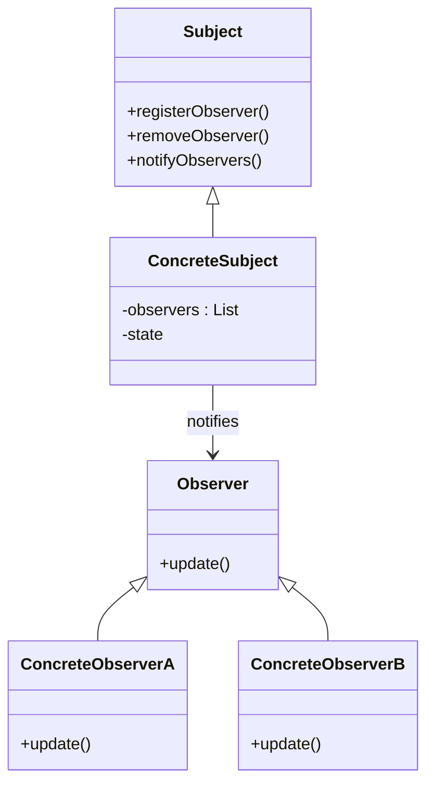
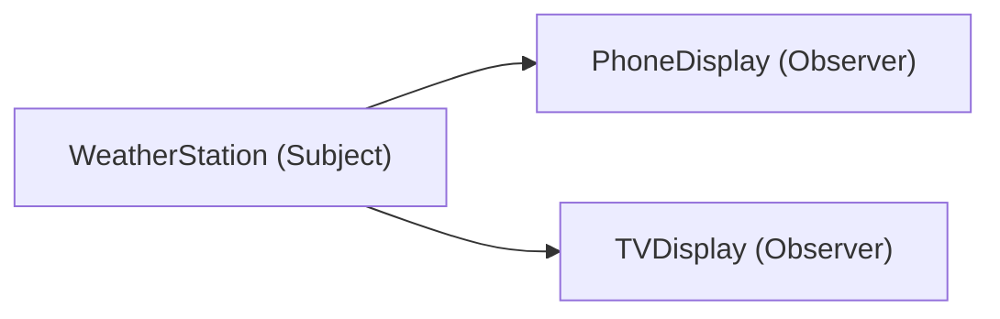

# Spring 7 - REST MVC

## Tecnologias

* Java 25 LTS
* Spring Boot 4.0.3
* Spring Framework
* REST MVC

### Dependências

* **I/O**
    * Validation (I/O) 4.0.3
* **OPS**
    * Spring Boot Actuator 4.0.3
* **WEB**
    * Spring Web MVC (Web) 4.0.3
* **Developer Tools**
    * Project Lombok 1.18.42
    * Spring Boot DevTools 4.0.3
    * Docker Compose Support
* **SQL**
    * Spring Data JPA 4.0.3
    * MySQL Driver 9.6.0
    * H2 Database 4.0.3
    * Flyway Migration 4.0.3
        * Flyway MySQL 12.0.3
* **Security**
    * Spring Security 4.0.3
    * OAuth2 Resource Server 4.0.3
* **Testing**
    * Testcontainers 4.0.3
      * JUnit Jupiter 2.0.3
      * MySQL 2.0.3
* **Others**
    * MapStruct 1.6.3
    * Open CSV 5.12.0
    * Springdoc OpenAPI
        * Web MVC UI 3.0.0
        * Common 3.0.0
    * Atlassian Swagger Request Validator 2.46.0
    * Groovy 4.0.29
    * Jackson Core 3.1.0
    * Rest Assured 5.5.6
* **Spring Boot Starter Tests**
    * Data JPA
    * Validation
    * WebMVC
    * Flyway
    * OAuth2 Resource Server
    * Security
    * Actuator

### Plugins

* Spring Boot Maven
    * Project Lombok 1.18.42
* Springdoc OpenAPI Maven 1.5
* Apache Maven Compiler
    * MapStruct Processor 1.6.3
    * Project Lombok 1.18.42
    * Lombok MapStruct Binding 0.2.0
* Maven Failsafe 3.5.2

## Documentations

* [OpenAPI](./openapi/openapi.json)
* [Beer](./docs/BEER.md)
* [Customer](./docs/CUSTOMER.md)

## References

* [SFG Brewery API](https://sfg-beerDTO-works.github.io/brewery-api/)
* [JSON Path](https://github.com/json-path/JsonPath)
* [MapStruct Documentation](https://mapstruct.org/documentation/reference-guide/)
* [Spring Docs - Testcontainers](https://docs.spring.io/spring-boot/reference/testing/testcontainers.html)
* [Maven Surefire Plugin](https://maven.apache.org/surefire/maven-surefire-plugin/)
* [surefire:test](https://maven.apache.org/surefire/maven-surefire-plugin/test-mojo.html)
* [Opencsv Users Guide - Quick Start](https://opencsv.sourceforge.net/#quick_start)

---

## Banco de Dados MySQL

- [Script MySQL](./src/scripts/mysql-init.sql)

### Configuração

- Host: `localhost`
- Porta: `3306` (porta padrão do MySQL)
- Banco: `restdb`
- Usuário: `restadmin` (substituir pelo seu usuário)
- Senha: `password` (substituir pela sua senha)

Após testar a conexão com sucesso, o ambiente estará pronto para integração com o Spring Boot.

### Observações

* Esse usuário não possui privilégios globais de administrador, estando restrito ao schema `restdb`.
* A senha utilizada no exemplo é "password" apenas para fins didáticos. Em ambientes de produção, deve-se utilizar
  senhas fortes e políticas adequadas de segurança.

---

## Executar Testes

| Objetivo      | Comando                                                |
|:--------------|:-------------------------------------------------------|
| Testar Classe | `mvn test -Dtest=NomeClasse`                           |
| Testar Método | `mvn test -Dtest=NomeClasse#nomeMetodo`                |
| Debug         | `mvn -Dmaven.surefire.debug test -Dtest=Classe#Metodo` |

## Docker

- `docker ps`
- `docker ps -a`
- `docker start`: Inicializar o Docker
- `docker stop`: Finalizar o Docker
- `docker run hello-world`
- `docker --version`: Verificar a versão do Docker

## Linux

- `sudo apt update`: Atualizar
- `sudo apt install -y`: Instalar
- `sudo apt remove -y`: Remover
- `sudo apt update && sudo apt upgrade -y`
- `sudo service docker start`: Inicializar o Docker
- `sudo service docker restart`: Reinicializar o Docker
- `sudo service docker stop`: Para o Docker
- `clear`: Limpar console (CLI)

### Exemplo de Instalação

- `sudo apt install -y git`: Instalando o Git
- `sudo apt install -y maven`: Instalando o Maven

---

## Maven Failsafe plugin

1. `mvn clean`
2. `mvn test`
3. `mvn verify`

---

## Atualizações realizadas neste projeto

Comparando o **código do instrutor** com a **implementação deste projeto**, foram aplicadas diversas melhorias
importantes:

| Componente       | Instrutor        | Sua versão  | Situação   |
|------------------|------------------|-------------|------------|
| Spring Boot      | 3.4.0            | 4.0.3       | Atualizado |
| Spring Framework | 6.x              | 7.0.5       | Atualizado |
| Java             | 21               | 25 LTS      | Atualizado |
| MapStruct        | 1.5.5.Final      | 1.6.3       | Atualizado |
| OpenCSV          | 5.9 (vulnerável) | 5.12.0      | Corrigido  |
| Flyway           | 11.x             | 12.0.3      | Atualizado |
| Testcontainers   | versões antigas  | atualizadas | Melhorado  |

Este projeto já está **tecnicamente mais moderno e seguro que o do curso**.

---

## Vulnerabilidade identificada: Jackson

### Dependência vulnerável detectada

```
tools.jackson.core:jackson-core:3.0.4
```

Relacionada ao advisory:

```
GHSA-72hv-8253-57qq
```

Situação:

| Biblioteca   | Versão | Status     |
|--------------|--------|------------|
| jackson-core | 3.0.4  | Vulnerável |
| jackson-core | 3.1.0  | Corrigida  |

Essa dependência entra **transitivamente via**:

```text
spring-boot-docker-compose
```

Cadeia de dependência:

```
spring-boot-docker-compose
   → tools.jackson.core:jackson-databind
       → tools.jackson.core:jackson-core 3.0.4
```

---

# Correção recomendada

Forçar versão segura no `pom.xml`.

Adicionar:

```xml

<dependencyManagement>
    <dependencies>
        <dependency>
            <groupId>tools.jackson.core</groupId>
            <artifactId>jackson-core</artifactId>
            <version>3.1.0</version>
        </dependency>
    </dependencies>
</dependencyManagement>
```

Ou explicitamente:

```xml

<dependency>
    <groupId>tools.jackson.core</groupId>
    <artifactId>jackson-core</artifactId>
    <version>3.1.0</version>
</dependency>
```

---

## Nota Técnica — Compatibilidade entre Java 25 e Groovy em testes com RestAssured

Durante a atualização do projeto para tecnologias mais recentes, especificamente **Java SE 25 LTS** e **Spring Boot 4**,
foi identificado um problema de compatibilidade envolvendo o **Groovy**, utilizado internamente pela biblioteca
**RestAssured**.

### Contexto da atualização

O projeto original da aula foi desenvolvido utilizando o seguinte stack:

* Java 21
* Spring Boot 3.4
* RestAssured 5.x
* Groovy (dependência transitiva do RestAssured)

Na atualização do ambiente para versões mais recentes:

* Java 25 LTS
* Spring Boot 4.0.3
* RestAssured 5.5.6

passou a ocorrer uma falha durante a execução dos testes automatizados.

### Erro observado

Durante a execução do teste de integração com RestAssured, ocorreu a seguinte exceção:

```
java.lang.NullPointerException: Cannot invoke "Object.hashCode()" because "key" is null
```

O stacktrace aponta para classes internas do **Groovy runtime**, especificamente durante a execução do método
responsável por aplicar configurações de proxy (`applyProxySettings`) dentro do RestAssured.

### Causa

O **RestAssured utiliza Groovy internamente para a construção dinâmica das requisições HTTP**. Em ambientes mais
recentes, como **Java 25**, algumas mudanças na inicialização de propriedades do sistema relacionadas a rede e proxy
podem resultar em valores `null`. Versões específicas do Groovy não tratam corretamente esses casos, ocasionando uma
exceção dentro de estruturas internas como `ConcurrentHashMap`.

Portanto, o problema não está relacionado ao **Spring Boot**, **Spring Security** ou à implementação do controller
testado, mas sim à **compatibilidade entre o Groovy utilizado pelo RestAssured e o Java 25**.

### Solução adotada

Para resolver o problema, foi necessário **forçar uma versão mais recente do Groovy**, compatível com as mudanças
presentes no Java 25.

Exemplo de dependência adicionada ao projeto:

```xml

<dependency>
    <groupId>org.apache.groovy</groupId>
    <artifactId>groovy</artifactId>
    <version>4.0.29</version>
    <scope>test</scope>
</dependency>
```

Essa atualização garante que o runtime do Groovy utilizado nos testes seja compatível com a versão mais recente do Java.

### Conclusão

A atualização para **Java 25 LTS** pode introduzir incompatibilidades em bibliotecas que dependem de **metaprogramação
ou reflexão avançada**, como é o caso do Groovy. Ao utilizar ferramentas como **RestAssured**, é importante garantir que
a versão do Groovy transitivamente utilizada esteja atualizada e compatível com a versão do Java adotada no projeto.

Esse tipo de ajuste é comum durante migrações para versões recentes da plataforma Java e faz parte do processo de
adaptação do ecossistema de bibliotecas à nova versão da JVM.

---

## Java Virtual Threads com Windows

Para verificar o consumo de memória pode utilizar o PowerShell

1. Execute a aplicação
2. Verifique o PID exibido no log da aplicação (ou na IDE)
3. Execute o comando abaixo no PowerShell:
   ```shell
   Get-Process java | Select-Object Id, ProcessName, WorkingSet
   ```
   Ou se preferir, com conversão para MB:
   ```shell
   Get-Process java | Select-Object Id, ProcessName, @{Name="MemoriaMB";Expression={[math]::round($_.WorkingSet/1MB,2)}}
   ```

### Teste com Threads Habilitada

**Exemplo de como encontrar o PID no log da aplicação**

```shell
Starting Spring7RestMvcApplication using Java 25.0.2 with PID 28568
```

**Exemplo de saída sem conversão**

```shell
   Id ProcessName WorkingSet
   -- ----------- ----------
14596 java         151474176
28568 java         312487936
31940 java         829603840
```

PID da aplicação -> 28568
Mémoria -> 312487936

**Exemplo de saída com conversão para MB**

```shell
   Id ProcessName MemoriaMB
   -- ----------- ---------
22684 java           144,84
28568 java           298,12
31940 java           781,75
```

PID da aplicação -> 28568
Mémoria em MB -> 298,12

### Teste com Threads Desabilitada

**Exemplo de como encontrar o PID no log da aplicação**

```shell
Starting Spring7RestMvcApplication using Java 25.0.2 with PID 26412
```

**Exemplo de saída sem conversão**

```shell
   Id ProcessName WorkingSet
   -- ----------- ----------
21604 java         151465984
26412 java         426307584
31940 java         821194752
```

PID da aplicação -> 26412
Mémoria -> 151465984

**Exemplo de saída com conversão para MB**

```shell
   Id ProcessName MemoriaMB
   -- ----------- ---------
21604 java           144,48
26412 java            408,4
31940 java           790,38
```

PID da aplicação -> 26412
Mémoria em MB -> 408,4

| with virtual threads | without virtual threads |
|:---------------------|:------------------------|
| 298,12MB             | 408,4MB                 |

---

## Spring Events

### Observer Pattern



---

### Exemplo Conceitual (Estação Meteorológica)


