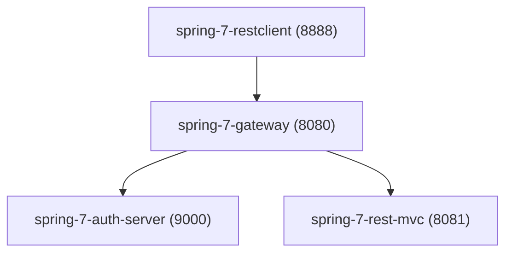

# Spring 7 - Rest Client

## Objetivo

A aplicação `spring-7-restclient` tem como objetivo demonstrar a utilização do `RestClient` do Spring para consumo de APIs REST de forma moderna e fluente.

O projeto explora a implementação completa de operações CRUD (Create, Read, Update, Delete), evidenciando:

* Construção de requisições HTTP com API fluente
* Integração com serviços REST externos
* Manipulação de respostas HTTP (headers, status e body)
* Testes utilizando *mock server*

## Tecnologias

* Java 25 LTS
* Spring Framework 7
* Spring Boot 4.0.3
* `RestClient`
* `RestTemplateBuilder`
* JUnit
* Mockito
* Mock HTTP Server
* Spring Data Commons
* Project Lombok 1.18.42 (Developer Tools)

## Funcionalidades

A aplicação implementa as seguintes operações sobre o recurso `BeerDTO`:

### Criar recurso

* Método: `createBeer()`
* Estratégia:
    * Executa `POST`
    * Recupera o header `Location`
    * Realiza `GET` subsequente para obter o objeto criado

### Buscar por ID

* Método: `getBeerById()`
* Estratégia:
    * Executa `GET`
    * Utiliza `retrieve().body(BeerDTO.class)`

### Atualizar recurso

* Método: `updateBeer()`
* Estratégia:
    * Executa `PUT`
    * Realiza `GET` subsequente para obter o recurso atualizado

### Deletar recurso

* Método: `deleteBeer()`
* Estratégia:
    * Executa `DELETE`
    * Apenas confirma execução via status HTTP
* Método: `listBeers()`

#### Sem parâmetros

* Delega para:

  ```java
  listBeers(null, null, null, null, null);
  ```

#### Com parâmetros

Suporta filtros:

* `beerName`
* `beerStyle`
* `showInventory`
* `pageNumber`
* `pageSize`

Utiliza `UriComponentsBuilder` para montagem dinâmica da URL.

## Arquitetura

A aplicação atua como cliente HTTP dentro de um ecossistema distribuído.



### Descrição do fluxo

1. O `RestClient` envia requisições para o Gateway
2. O Gateway (`Spring Cloud Gateway`) realiza:
    * Roteamento
    * Autenticação via OAuth2 (JWT)
3. As requisições são encaminhadas para o serviço REST (`spring-7-rest-mvc`)
4. O `spring-7-auth-server` valida autenticação

## Arquitetura Interna

### Configuração do cliente

* Utiliza `RestTemplateBuilder` como base
* Cria um `RestClient.Builder`
* Aplica padrão de fábrica para instanciar o cliente

Fluxo:

1. `RestTemplateBuilder` é configurado
2. É utilizado para criar `RestClient.Builder`
3. O `RestClient` é instanciado sob demanda

### Características do `RestClient`

* API fluente (similar ao `WebClient`)
* Execução síncrona

## Uso

### Execução local

Pré-requisitos:

* Java instalado
* Serviços auxiliares ativos:
    * Gateway
    * Auth Server
    * REST API
    * Banco de dados

### Fluxo de uso

Exemplo lógico de operação:

1. Criar recurso via `POST`
2. Recuperar via `GET`
3. Atualizar via `PUT`
4. Remover via `DELETE`
5. Listar com ou sem filtros

## Testes

A aplicação utiliza testes baseados em *mock server* para simular interações HTTP.

### Estratégias utilizadas

#### Create

* Mock de `POST`
* Retorno do header `Location`
* Mock de `GET` subsequente

#### Get by ID

* Mock de `GET`
* Retorno de `BeerDTO`
* Validação do objeto retornado

#### Update

* Mock de `PUT` (`204 No Content`)
* Mock de `GET` subsequente
* Validação do recurso atualizado

#### Delete

* Mock de `DELETE`
* Verificação do envio correto do ID

#### List

* Mock de `GET` com e sem parâmetros
* Validação de paginação (`Page<BeerDTO>`)

### Testes com servidor real

* Integração com:
    * Gateway
    * Auth Server
    * REST API
* Validação de:
    * Roteamento
    * Autenticação
    * Respostas reais

Observação:

* Diferenças de contagem podem ocorrer (não críticas)

## Conclusão

O `RestClient` representa a evolução do consumo de APIs REST no ecossistema Spring.

Principais benefícios:

* API fluente e mais legível
* Integração simples com infraestrutura existente
* Substituição moderna ao `RestTemplate`

Considerações finais:

* O `RestTemplate` ainda é suportado, porém considerado legado
* O `RestClient` é recomendado para novos projetos
* Suporta completamente operações REST:
    * `GET`
    * `POST`
    * `PUT`
    * `DELETE`

A aplicação demonstra, de forma prática, como implementar e testar um cliente REST moderno, preparado para arquiteturas distribuídas e seguras.
